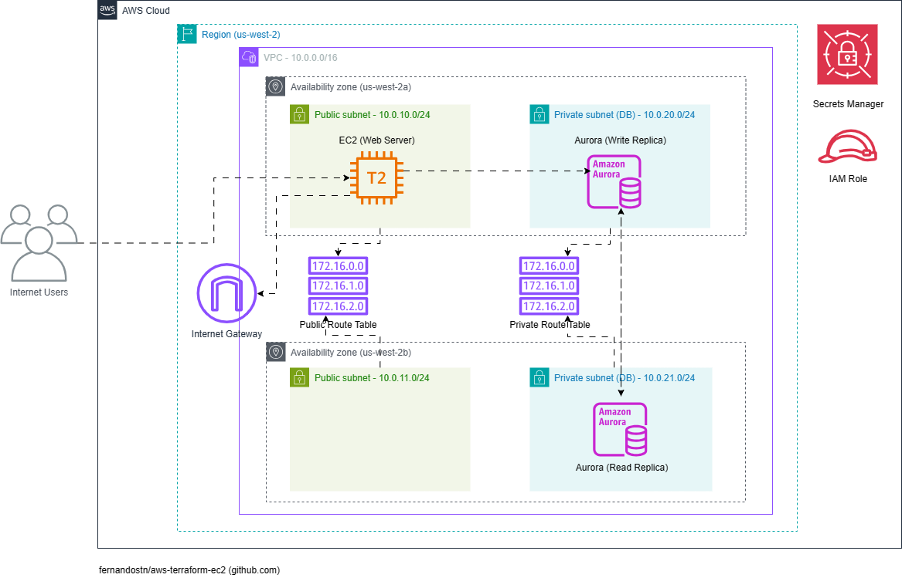

# aws-terraform-ec2

Este projeto apresenta uma arquitetura AWS para uma aplicação Web hospedada em uma instância EC2 e com acesso à um cluster multi-az MySQL do Amazon Aurora (alta disponibilidade):

## Detalhamento
A arquitetura proposta é formada por:
- Uma VPC configurada para duas zonas de disponibilidade
- Duas subnets públicas, uma em cada zona de disponibilidade
- Duas subnets privadas para recursos de banco de dados, uma em cada zona de disponibilidade
- Um Internet Gateway para acesso à Internet
- Uma instância EC2 em uma subnet pública executando um web server
- Um cluster multi-az MySQL do Amazon Aurora com réplicas de escrita e leitura em zonas de disponibilidade distintas
- Um secret do Secrets Manager para acesso da instância EC2 ao cluster do Amazon Aurora
- Uma role do IAM associada à instância EC2 para acesso ao cluster do Amazon Aurora

## Módulos Terraform
Para esta arquitetura foi utilizado o Terraform como ferramenta de IaC. Este projeto utiliza três módulos que criam os recursos relacionados entre si:

### Network
- VPC
- Subnets pública e privada
- Internet Gateway
- Route Table pública
- Route table privada
- Associação da Route Table pública com as subnets públicas
- Associação da Route Table privada com as subnets privadas
- Security Group liberando o acesso a partir da internet para as portas de SSH e HTTP na instância EC2
- Security Group liberando o acesso a partir do SG configurado na instâcia EC2 para a porta do MySQL no cluster do Amazon Aurora

### EC2
- Instância EC2 com as seguintes características:
    - AMI Amazon Linux
    - User Data que executa um Shell Script criado a partir de exemplo de aplicação disponiblizado pela Amazon em https://static.us-east-1.prod.workshops.aws/public/dd38a0a0-ae47-43f1-9065-f0bbcb15f684/assets/immersion-day-app-php7.zip
- Key Pair para acesso SSH à instância EC2
- IAM Role e Policy Inline que configura a permissão para a instância EC2 ler o secret do Secrets Manager com as credenciais de banco de dados

### DB
- Subnet Group
- Cluster MySQL do Amazon Aurora
- Duas instâncias do cluster em zonas de disponibilidade distintas para fins de alta disponibilidade
- Secret do Secrets Manager para armazenar as credenciais do banco de dados

## Inputs

| Nome | Descrição | Tipo | Default |
| -------------- | -------------- | ------------- | ------------- |
| owner_project | Tag de identificação para todos os recursos criados na AWS | String | `"Fernando Santana"` |
| managed_by_project | Tag de identificação para todos os recursos criados na AWS | String | `"IAC Terraform"` |
| region_project | Região onde será criado o projeto | String | `"us-west-2"` |
| vpc_cidr | CIDR da VPC a ser criada | String | `"10.0.0.0/16"` |
| az_count | Quantidade de AZs | Number | 2 |
| instance_type | Tipo da Instância EC2 a ser criada | String | `"t3.micro"` |

## Outputs

| Nome | Descrição | Módulo | Utilizado em |
| -------------- | -------------- | ------------- | ------------- |
| subnet_public_id | ID da subnet pública criada | Network | Módulo EC2 |
| subnet_private_db_id | ID da subent privada (banco de dados) criada | Network | Módulo DB |
| sg_public_id | Security Group público criado | Network | Módulo EC2 |
| sg_private_db_id | Security Group privado (banco de dados) criado | Network | Módulo DB |
| ec2_public_dns | Endereço público da instância EC2 | EC2 | Output para o usuário |
