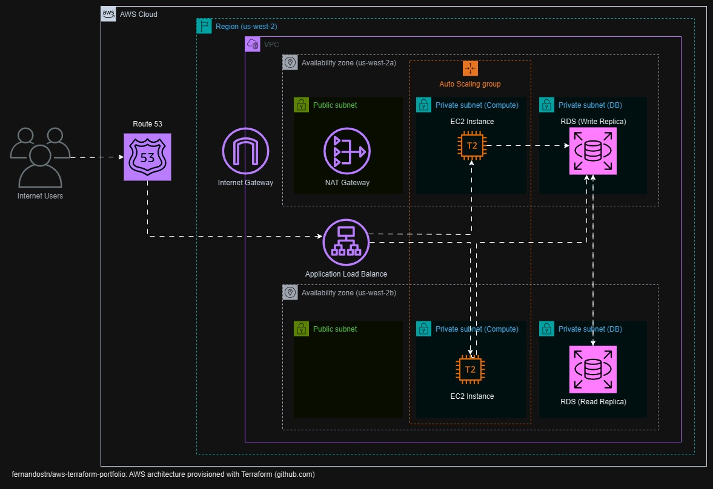

# aws-terraform-ec2

## Objetivo
Este repositório tem por objetivo apresentar uma arquitetura AWS criada através do Terraform. Esta arquitetura é apresentada de acordo com o diagrama abaixo:

## Detalhamento
A arquitetura proposta é composta de:
- Uma zona DNS criada no Route 53
- Um Application Load Balance para o balanceamento das requisições
- Um Auto Scaling Group para provisionamento automático das instâncias EC2
- Um banco RDS com uma réplica de escrita e outra de leitura (alta disponibilidade)
- Uma VPC
- Duas subnets públicas, uma em cada zona de disponibilidade
- Duas subnets privadas para recursos de computação, uma em cada zona de disponibilidade
- Duas subnets privadas para recursos de banco de dados, uma em cada zona de disponibilidade
- Um Internet Gateway para acesso à Internet
- Um NAT Gateway para acesso à Internet a partir das subnets privadas

## Módulos Terraform