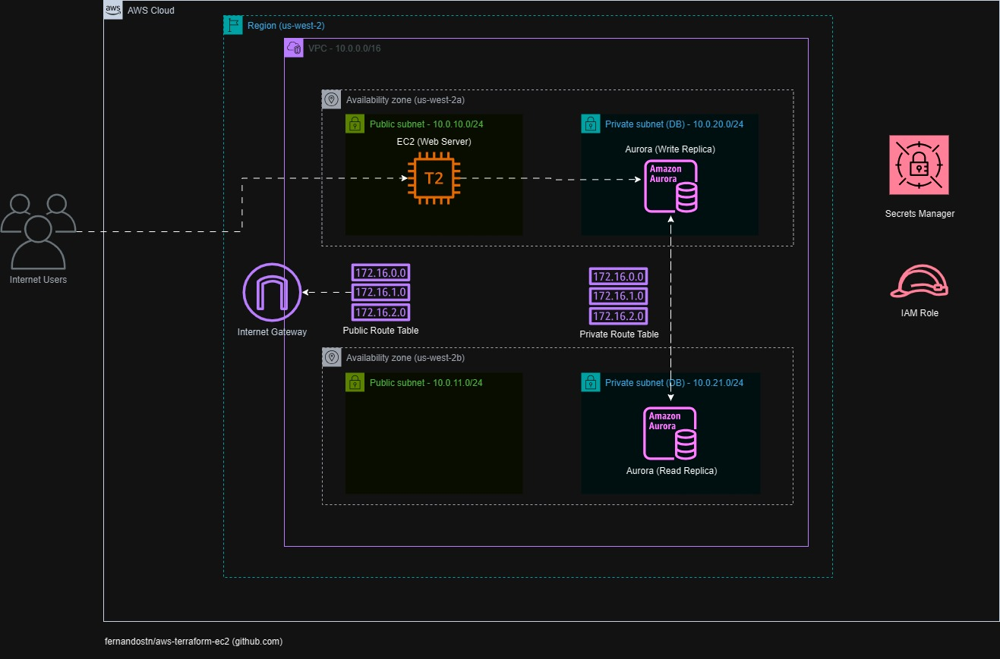

# aws-terraform-ec2

## Objetivo
Este repositório tem por objetivo apresentar uma arquitetura AWS criada através do Terraform. Esta arquitetura é apresentada de acordo com o diagrama abaixo:

## Detalhamento
A arquitetura proposta é composta de:
- Uma instância EC2 em uma subnet pública executando um web server Apache
- Um cluster Aurora (MySql) com uma réplica de escrita e outra de leitura (alta disponibilidade)
- Uma VPC
- Duas subnets públicas, uma em cada zona de disponibilidade
- Duas subnets privadas para recursos de banco de dados, uma em cada zona de disponibilidade
- Um Internet Gateway para acesso à Internet
- Um recurso do Secrets Manager para acesso da instância EC2 ao cluster Aurora
- Uma role do IAM associada à instância EC2 para acesso ao cluster Aurora

## Módulos Terraform